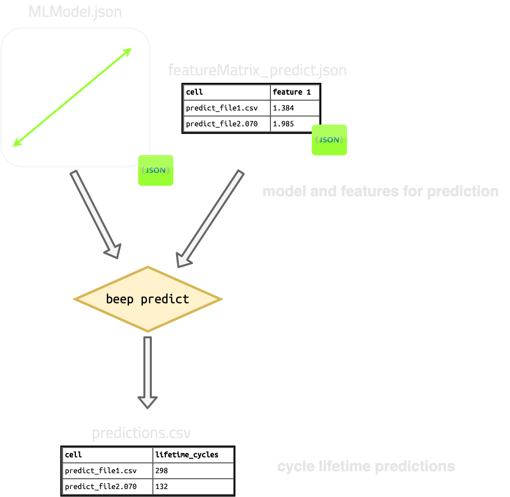

# Predict


`beep predict` runs previously trained models to predict degradation characteristics based on a new input feature matrix.

`beep predict` takes in a previously trained model json file (e.g., trained with [`beep train`](/Command%20Line%20Interface/4%20-%20train/) and a previously generated feature matrix (e.g., generated with [`beep featurize`](/Command%20Line%20Interface/3%20-%20featurize/)) which
you want ML predictions for. Each row in this input dataframe corresponds to a single cycler file.

The output is a dataframe of predictions of degradation characteristics for each file, serialized to disk as json.




## Predict help dialog


```shell
$: beep predict --help

Usage: beep predict [OPTIONS] MODEL_FILE

  Run a previously trained model to predict degradation targets.The MODEL_FILE
  passed should be an output of 'beep train' or aserialized
  BEEPLinearModelExperiment object.

Options:
  -fm, --feature-matrix-file TEXT
                                  Feature matrix to use as input to the model.
                                  Predictions are basedon these features.
                                  [required]
  -o, --output-filename FILE      Filename (json) to write the final predicted
                                  dataframe to.
  --predict-sample-nan-thresh FLOAT
                                  Threshold to keep a sample from any
                                  prediction set.
  --help                          Show this message and exit.

```