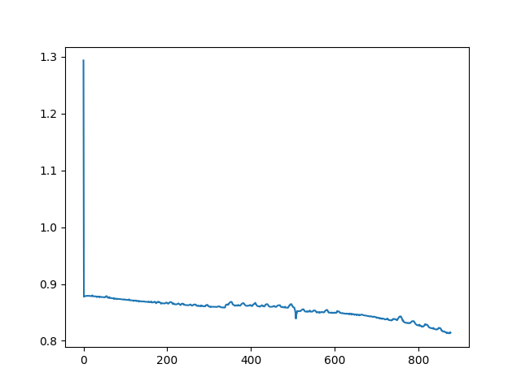

# Python tutorial 1: Start here

This notebook is meant to demonstrate basic usage of the beep package with data from "Data-driven prediction of battery cycle life before capacity degradation" KA Severson, et al. Nature Energy 4 (5), 383-391

This data is available for download from https://data.matr.io/1/ . For brevity, only one test is included in this notebook but the example can easily be extended to a larger number of files.


## Step 0: Install beep and set environment

If you have not already installed beep, run:


```bash
pip install beep
```

We will also need to set two environment variables for beep. 

- `BEEP_ENV`: Set the compute environment for beep to use (AWS, local, etc.). We will set to `dev` for working locally.
- `BEEP_PROCESSING_DIR`: The central directory BEEP will use to process intermediate files and organize data.

```bash
export BEEP_ENV="dev"
export BEEP_PROCESSING_DIR="./tutorial/"
``` 


## Step 1: Download example battery cycler data

The example data set we are using here comes from a set of A123 LFP cells cycled under fast charge conditions. While this tutorial is configured for downloading a single cell, its also possible to download the entire data set and run all of the processing steps on all of the data.
 
 Note that for Arbin files, we recommend having the metadata file in addition to the data file in order to perform the data structuring correctly (though it is not required).
 
 


```python
import os
import requests

print('Beginning file download with requests')
this_dir = os.path.dirname(os.path.abspath(__file__))
data_dir = os.path.join(this_dir, 'Severson-et-al')

try:
    os.makedirs(data_dir)
except FileExistsError:
    pass

url = 'https://data.matr.io/1/api/v1/file/5c86c0bafa2ede00015ddf70/download'
r = requests.get(url)

with open(os.path.join(data_dir, '2017-05-12_6C-50per_3_6C_CH36.csv'), 'wb') as f:
    f.write(r.content)

url = 'https://data.matr.io/1/api/v1/file/5c86c0b5fa2ede00015ddf6d/download'
r = requests.get(url)

with open(os.path.join(data_dir, '2017-05-12_6C-50per_3_6C_CH36_Metadata.csv'), 'wb') as f:
    f.write(r.content)

# Retrieve HTTP meta-data
print("Status code", r.status_code)
print("File type recieved", r.headers['content-type'])
print("File encoding", r.encoding)
```


```
# output
Beginning file download with requests
Status code 200
File type recieved text/csv
File encoding ISO-8859-1
```

You should now have two files in your data directory: 

```
├── Severson-et-al
│   ├── 2017-05-12_6C-50per_3_6C_CH36.csv
│   └── 2017-05-12_6C-50per_3_6C_CH36_Metadata.csv

```

## Step 2: Data pipelining - validation, structuring, featurization

Now that we have our data, we can start using BEEP!

Fist, we can create a list of all of the files in the data directory and then runs the three data pipeline processing steps on each of the files.

#### a. Validation
This module determine if the data conforms to expected format with the correct column names and with values inside an expected range.

#### b. Structuring
The structuring module turns the time series data from the cycler machine into a json-like structure with DataFrame objects. The DataFrame objects include a summary DataFrame with per cycle statistics, and a DataFrame with interpolated charge and discharge steps of the regular cycles. For files that have diagnostic cycles that were programmatically inserted, separate DataFrame objects are created with summary statistics and interpolated steps for the diagnostic cycles.

#### c. Featurization
Featurization uses the structured objects to calculate statistically and physically relevant quantities for the purpose of building predictive machine learning models. The objects can be selected and joined for the purposes of training the model, or used for predicting individual outcomes.


```python
import json
import glob

# Import beep scripts
from beep import validate, structure, featurize


file_list = glob.glob(os.path.join(data_dir, '*[0-9].csv'))

mode = 'events_off'
mapped  =  {
            "mode": 'events_off',  # mode run|test|events_off
            "file_list": file_list,  # list of file paths ['path/test1.csv', 'path/test2.csv']
            'run_list': list(range(len(file_list)))  # list of run_ids [0, 1]
            }
mapped = json.dumps(mapped)
# Validation
validated = validate.validate_file_list_from_json(mapped)
validated_output = json.loads(validated)
validated_output['mode'] = mode  # mode run|test|events_off
validated_output['run_list'] = list(range(len(validated_output['file_list'])))
validated = json.dumps(validated_output)

print(validated)

# Data structuring
structured = structure.process_file_list_from_json(validated)
structured_output = json.loads(structured)
structured_output['mode'] = mode  # mode run|test|events_off
structured_output['run_list'] = list(range(len(file_list)))
structured = json.dumps(structured_output)

print(structured)

# Featurization
featurized = featurize.process_file_list_from_json(structured)
featurized_output = json.loads(featurized)
featurized_output['mode'] = mode  # mode run|test|events_off
featurized_output['run_list'] = list(range(len(file_list)))
featurized = json.dumps(featurized_output)

```

```
100%|██████████| 1/1 [00:01<00:00,  1.74s/it]
{"file_list": ["./Severson-et-al/2017-05-12_6C-50per_3_6C_CH36.csv"], "run_list": [0], "validity": ["valid"], "message_list": [{"comment": "", "error": ""}], "mode": "events_off"}
100%|██████████| 877/877 [03:48<00:00,  3.85it/s]
100%|██████████| 877/877 [02:07<00:00,  6.89it/s]
{"file_list": ["/path/to/your/beep/processing/data-share/structure/2017-05-12_6C-50per_3_6C_CH36_structure.json"], "run_list": [0], "result_list": ["success"], "message_list": [{"comment": "", "error": ""}], "invalid_file_list": [], "mode": "events_off"}
```

## Step 3: Examine data in the structure file


#### Interpolation data

The code below demonstrates how to access the DataFrame objects in the structure file. Loading the file is substantially faster than analyzing the raw time series data. The interpolated data also provides the ability to calculate differences between cycles.

```python
from matplotlib import pyplot as plt
from monty.serialization import loadfn

processing_dir = os.environ.get("BEEP_PROCESSING_DIR", "tutorial")
struct = loadfn(os.path.join(processing_dir, 'data-share', 'structure', '2017-05-12_6C-50per_3_6C_CH36_structure.json'))
reg_charge = struct.structured_data[struct.structured_data.step_type == 'charge']
print(reg_charge.current[reg_charge.cycle_index == 25].mean())
print(reg_charge.cycle_index.max())
print(reg_charge.charge_capacity[reg_charge.cycle_index == 25].max())
print(reg_charge.charge_capacity[reg_charge.cycle_index == 600].max())
plt.plot(reg_charge.charge_capacity[reg_charge.cycle_index == 600], reg_charge.voltage[reg_charge.cycle_index == 600])
plt.show()
```

```
# output
4.697416
876
1.1737735
1.1737735
```


#### Summary data

The summary data provides a quick way of determine how the battery cell degrades during the cycling experiment. Quantities such as energy efficiency per cycle and total charge throughput at a given cycle number are calculated.

```python
plt.plot(struct.structured_summary.cycle_index, struct.structured_summary.energy_efficiency)
plt.show()
```




## Congrats!

You've made it to the end of the tutorial. 
